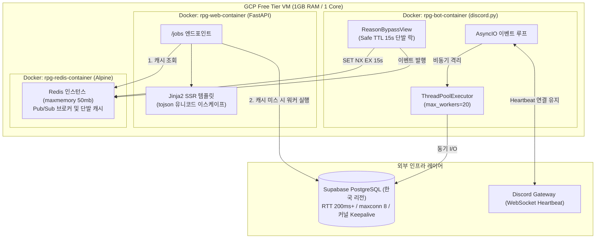

---
title: "RPG Sync 프로젝트: 물리적 제약 환경에서 교과서적 이상론을 버리고 병목을 뚫은 4가지 실용적 엔지니어링 타협"
slug: "proj-rpg-sync-project-06-pragmatic-engineering-compromises"
description: "GCP 프리티어 1GB RAM과 태평양 횡단 RTT 200ms라는 물리적 인프라 제약 속에서 커널 TCP Keepalive, 스레드풀 격리, Safe TTL 단발 락, Jinja2 SSR로 병목을 극복한 4가지 엔지니어링 타협 기록"
pubDate: 2026-09-10
category: "프로젝트/실시간 RPG 동기화 엔진"
status: "published"
tags: ["Distributed-System", "Python", "Database", "Performance-Tuning", "Architecture"]
---

# 교과서적 이상론을 버리고 병목을 뚫다: 물리적 제약 환경에서의 4가지 실용적 엔지니어링 타협

## 1. 개요 및 프로젝트 배경

[Part 1 아키텍처 포스트](/security-agent-toolkit/blog/proj-rpg-sync-project-01-problem-definition-and-architecture/)에서 디스코드 중심의 단일 진실 공급원 파이프라인을 설계하고, [Part 3 웹 보안 포스트](/security-agent-toolkit/blog/proj-rpg-sync-project-03-fullstack-security-hardening/)에서 웹 위협 모델링과 심층 방어 체계를 다루었다.

시스템 기능이 확장되고 실제 유저들이 유입되면서, 설계 단계에서는 드러나지 않던 물리적 인프라의 극한 제약이 시스템의 발목을 잡기 시작했다.

아키텍처 교과서나 프레임워크 문서는 항상 가장 이상적인 패턴을 표준 지침처럼 제시한다. 커넥션 풀에서 연결을 꺼낼 때마다 핑 쿼리로 검증하고, 모든 입출력 드라이버를 순수 비동기로 전환하며, 분산 락은 백그라운드 갱신 스레드로 유지하고, 웹 프론트엔드는 단일 페이지 애플리케이션으로 분리하라는 식이다.

그러나 본 프로젝트가 마주한 실제 운영 인프라는 극단적인 물리적 제약 조건을 내포하고 있었다. 월 0원 예산 유지를 위한 GCP 프리티어 1GB RAM 단일 코어 가상머신과 한국 Supabase PostgreSQL 간의 태평양 횡단 왕복 지연시간 200ms 이상이라는 물리적 한계가 존재했다.

> 물리적 인프라 제약 속에서 서비스 생존과 보안은 절대 사수하고, 교과서적 순수성과 존재하지 않는 미래 트래픽 대비는 과감히 버린다.

이 판단 기준 아래 이상론 대신 현실적 제약을 정면으로 돌파한 4가지 엔지니어링 타협을 단행했다.

---

## 2. 전체 산출물 구조 및 진단/파이프라인 체계

시스템은 단일 저사양 호스트 내부에서 서비스별 도커 컨테이너를 물리적으로 분리하고, 원격 데이터베이스 및 디스코드 게이트웨이와 통신하는 구조로 배치했다.



| 구성 요소 | 물리적 제약 및 잠재 위험 | 채택한 방어 기제 | 사수한 핵심 가치 |
| :--- | :--- | :--- | :--- |
| **PostgreSQL 커넥션 풀** | 태평양 횡단 RTT 200ms, TCP 사일런트 드롭 | 커널 TCP Keepalive 30초 + conn.closed (0ms) + 사후 재시도 데코레이터 | 정상 쿼리 레이턴시 200ms 절감 및 세션 크래시 방어 |
| **디스코드 봇 이벤트 루프** | 단일 스레드 비동기 루프 블로킹 시 게이트웨이 절단 | 전용 ThreadPoolExecutor 20개 격리 + 컨테이너 분리 | 디스코드 봇 실시간 생존성 사수 |
| **디스코드 UI 인터랙션 락** | 관리자 다중 클릭 및 동시 승인 시 멱등성 파괴 | Safe TTL 15초 단발 락 + Redis 50MB 메모리 상한 | 300ms 미만 작업의 멱등성 보장 및 OOM 원천 차단 |
| **웹 대시보드 렌더링** | 번들 수신 후 2차 API 호출로 인한 RTT 누적 및 XSS | Jinja2 SSR 초기 데이터 주입 + tojson 유니코드 이스케이프 | 왕복 지연 0회 및 스크립트 삽입 공격 표면 제거 |

---

## 3. 기존 체계의 한계와 도전 과제: 태평양 횡단 RTT 200ms와 1GB RAM의 물리적 한계

교과서적인 풀 검증 패턴을 적용했을 때 가장 먼저 맞닥뜨린 장벽은 태평양을 건너는 네트워크 지연시간이었다. 풀에서 커넥션을 꺼낼 때마다 연결 생존을 확인하기 위해 `SELECT 1` 쿼리를 날리는 모범 방식을 따르자, 단 3회의 데이터베이스 조회가 필요한 단일 웹 페이지 요청에서 기본 지연시간만 600ms 이상 누적되었다. 미국 호스트와 한국 데이터베이스 간의 왕복 200ms 지연이 고스란히 쿼리 실행 전 사전 세금으로 부과된 셈이었다.

더욱 치명적인 문제는 1GB RAM이라는 단일 코어 가상머신의 하드웨어 제약이었다. 비동기 이벤트 루프를 사용하는 디스코드 봇 내부에서 동기식 데이터베이스 라이브러리 `psycopg2` 호출이 메인 루프를 점유하자, 디스코드 게이트웨이와의 웹소켓 핑퐁 패킷이 지연되었다. 게이트웨이는 봇을 응답 불가 상태로 판단하고 연결을 강제 종료했으며, 프로세스는 재접속 루프에 빠져 메모리 누수를 겪었다.

그렇다고 모든 데이터베이스 접근 계층을 비동기 드라이버로 갈아엎기에는 1인 개발 환경의 리소스가 턱없이 부족했다. 또한 분산 락 갱신용 백그라운드 스레드를 띄우거나 프론트엔드를 단일 페이지 애플리케이션으로 분리하는 작업은 메모리 낭비와 추가 네트워크 왕복을 초래할 뿐이었다. 교과서적 이상론을 답습하는 행위 자체가 시스템 생존을 위협하는 병목으로 작용했다.

---

## 4. 엔지니어링 의사결정 및 리팩터링

### 4.1. DB 커넥션 검증 최적화: 커널 TCP Keepalive와 conn.closed 0ms 검사

커넥션 풀에서 커넥션을 꺼낼 때마다 원격 데이터베이스로 유효성 확인 쿼리를 보내는 것은 정상적인 요청 99%에 불필요한 200ms 지연을 강제한다. 이를 타파하기 위해 원격 소켓 통신을 생략하고 프로세스 메모리의 플래그만 검사하여 0ms로 즉시 반환하도록 코드를 수정했다.

```python
# src/database/connection.py
_db_pool = pool.ThreadedConnectionPool(
    2, 8,
    dsn=os.getenv("DATABASE_URL"),
    keepalives=1,
    keepalives_idle=30,
    keepalives_interval=10,
    keepalives_count=5
)

def get_connection():
    global _db_pool
    if _db_pool is None:
        initialize_pool()

    max_retries = 3
    for attempt in range(max_retries):
        conn = None
        try:
            conn = _db_pool.getconn()

            # 원격 핑 통신 없이 프로세스 메모리 플래그만 검사하여 0ms 반환
            if conn.closed != 0:
                raise OperationalError("Connection is closed.")

            return conn

        except (OperationalError, psycopg2.DatabaseError):
            if conn:
                _db_pool.putconn(conn, close=True)
            print(f"[Warning] Stale connection dropped. Retrying... ({attempt + 1}/{max_retries})")
```

소켓 통신 없는 메모리 검사 방식은 방화벽에 의한 유휴 연결 침묵 단절 상황에서 무한 대기가 발생할 수 있는 사각지대를 가진다. 이 취약점은 운영체제 커널 레벨의 TCP Keepalive 옵션을 풀 초기화 시점에 주입하여 해결했다.

유휴 상태 30초 경과 시 10초 간격으로 5회 확인 패킷을 전송하도록 커널 옵션을 강제하여, 끊어진 좀비 소켓을 50초 내에 운영체제가 감지하고 연결을 정리하도록 방어했다. 혹시 모를 연결 단절 예외는 `@db_retry(max_retries=2)` 데코레이터가 가로채어 풀에서 해당 커넥션을 즉시 폐기하고 자가 치유를 수행하도록 설계했다.

- **넘어간 부분:** 모든 커넥션이 쿼리 실행 직전 원격에서 살아있음을 사전 증명해야 한다는 결벽적 완결성을 포기했다. 극히 드문 유휴 단절 시 첫 1회 쿼리 실패 후 재시도 비용을 감수했다.
- **절대 사수한 부분:** 정상 요청의 200ms 지연시간 누적을 원천 차단하고, 커널 수준 소켓 감지와 사후 재시도로 서비스 중단을 방어했다.

### 4.2. 이벤트 루프 보호: 동기 psycopg2 호출의 전용 스레드풀 격리와 웹 캐시 계층

디스코드 봇은 단일 스레드 비동기 루프로 동작하므로, 동기식 데이터베이스 조회가 루프를 점유하면 즉시 게이트웨이 연결이 끊어진다. 전체 데이터베이스 레이어를 비동기 전용 드라이버로 전면 재작성하는 대신, 봇 전용 워커 스레드풀을 주입하여 동기 블로킹 호출을 격리했다.

```python
# src/bot/main.py
loop = asyncio.get_running_loop()
executor = concurrent.futures.ThreadPoolExecutor(max_workers=20)
loop.set_default_executor(executor)
```

`docker-compose.yml` 설정을 통해 디스코드 봇 컨테이너와 FastAPI 웹 컨테이너를 물리적으로 분리 구동하여 스레드 경합을 차단했다. 또한 커넥션 풀의 최대 크기를 8개로 엄격히 제한하고, 웹 엔드포인트에는 Redis 캐시 계층을 도입하여 데이터베이스 세션 고갈을 방어했다.

```python
# src/web/main.py
@app.get("/jobs", response_class=HTMLResponse)
@limiter.limit("30/minute")
async def serve_jobs(request: Request):
    cache_key = "cache:jobs:all"
    cached_jobs = await get_cache(cache_key)
    if cached_jobs and isinstance(cached_jobs, list) and len(cached_jobs) > 0:
        return templates.TemplateResponse(
            request=request,
            name="jobs.html",
            context={"request": request, "jobs": cached_jobs, "jobs_data": cached_jobs}
        )

    # 캐시 미스 시에만 워커 스레드에서 DB 조회 수행
    jobs_data = await asyncio.to_thread(get_all_jobs_for_web)
    await set_cache(cache_key, formatted_jobs, ex=600)
```

웹 요청은 10분 만료 주기의 Redis 캐시가 선제적으로 흡수하므로, 동시 접속자가 몰리더라도 실제 데이터베이스 커넥션 풀은 안정적인 8개 한도 내에서 유지된다.

- **넘어간 부분:** 순수 비동기 코드베이스라는 아키텍처적 결벽성과 수만 동시 접속을 가정하는 미래 트래픽 오버엔지니어링을 포기했다.
- **절대 사수한 부분:** 비즈니스 로직 재작성 공수를 아끼면서 디스코드 봇 게이트웨이 하트비트 생존을 완벽히 보장했다.

### 4.3. UI 멱등성 분산 락: 초단기 인터랙션에 맞춘 Safe TTL 15s 설계

디스코드 커뮤니티 관리자가 유저의 음성 채널 이탈 사유를 승인하거나 거절하는 버튼 인터랙션에서는 중복 클릭이나 복수 관리자의 동시 승인으로 인한 상태 충돌을 막아야 했다. 교과서적으로는 백그라운드 갱신 스레드가 포함된 분산 락을 구축하는 것이 정석으로 꼽힌다.

그러나 실제 인터랙션 처리 로직은 버튼 UI 비활성화와 Redis 메시지 1건 발행에 불과하여, 전체 소요 시간이 100ms에서 300ms 안팎에 수렴했다.

```python
# src/bot/cogs/users/reason_bypass.py
async def handle_click(self, interaction: discord.Interaction, action: str, mc_uuid: str):
    lock_key = f"rpgsync:processing_reason:{mc_uuid}"
    
    # 1. 15초 안전 만료 시간을 가진 단발성 락 획득
    acquired = await redis_client.set(lock_key, "1", ex=15, nx=True)
    if not acquired:
        await interaction.response.send_message("이미 처리 중이거나 완료된 사유입니다.", ephemeral=True)
        return

    try:
        await interaction.response.defer()
        for item in self.children:
            if isinstance(item, discord.ui.Button):
                item.disabled = True
        await interaction.message.edit(view=self)

        # 소요 시간 100~300ms 수준의 이벤트 발행 처리
        if action == "approve":
            await publish_message("rpgsync:bypass_granted", {"uuid": mc_uuid})
        elif action == "deny":
            await publish_message("rpgsync:kick_player", {"uuid": mc_uuid, "reason": "스태프에 의한 킥"})
    finally:
        # 명시적 락 해제
        await redis_client.delete(lock_key)
```

300ms 이내에 끝나는 초단기 작업에서 15초 만료 시간은 50배 이상의 안전 마진을 제공한다. 작업 진행 도중 락이 조기 만료되어 다른 프로세스로 소유권이 넘어갈 확률은 통계적으로 0에 수렴한다.

동시에 도커 환경에서 Redis 컨테이너에 `maxmemory 50mb --maxmemory-policy volatile-lru` 옵션을 강제하여, 1GB RAM 호스트에서 캐시 메모리가 폭주해 프로세스가 다운되는 위험을 차단했다.

- **넘어간 부분:** 수십 초 이상 트랜잭션이 지연되는 극단적 분산 환경을 가정한 자동 만료 연장 데몬 구축을 생략했다.
- **절대 사수한 부분:** 복잡한 데몬 스레드 도입 없이 관리자 연타 클릭에 의한 멱등성 파괴를 막고 호스트 메모리 안정성을 확보했다.

### 4.4. 렌더링 방식 전환: Jinja2 SSR과 tojson 유니코드 이스케이프를 통한 XSS 차단

프론트엔드와 백엔드를 완전히 분리하는 단일 페이지 애플리케이션 구조는 최신 웹 개발의 표준처럼 통용된다. 그러나 브라우저가 화면을 띄운 뒤 80여 개 직업 데이터를 다시 API로 요청하게 만들면, 미국 서버와 한국 클라이언트 간의 200ms 왕복 지연이 한 번 더 추가되어 첫 화면 렌더링 체감 속도가 급격히 저하된다.

이 문제를 해결하기 위해 클라이언트 사이드 렌더링을 걷어내고 Jinja2 서버 사이드 렌더링 방식을 채택했다.

```html
<!-- src/web/templates/jobs.html -->

<script>
    window.INITIAL_JOBS_DATA = {{ jobs_data | tojson }};
</script>
<script src="/static/main.js?v={{ get_mtime('main.js') }}"></script>

```

서버에서 첫 HTML 문서를 생성할 때 `window.INITIAL_JOBS_DATA`에 직업 데이터를 직접 주입하여 클라이언트의 추가 네트워크 왕복 횟수를 0회로 차단했다.

보안 무결성을 사수하기 위해 일반적인 원시 출력 필터 대신 Jinja2의 표준 `tojson` 필터를 적용했다. `tojson` 필터는 데이터 내부의 특수문자를 유니코드 이스케이프 형태로 치환하므로, 스크립트 태그 조기 종료를 통한 자바스크립트 주입 공격을 원천 차단한다. 서버 라우터에서도 데이터베이스 원시 레코드를 그대로 내보내지 않고 필요한 필드만 정제한 딕셔너리 형태로 포맷팅하여 민감 정보 유출을 차단했다.

- **넘어간 부분:** 최신 프론트엔드 프레임워크 기반의 컴포넌트 분리 및 단일 페이지 애플리케이션 트렌드를 포기했다.
- **절대 사수한 부분:** 2차 네트워크 왕복 제거로 첫 화면 렌더링 속도를 확보하고, 유니코드 이스케이프 주입으로 교차 사이트 스크립팅 공격 표면을 제거했다.

---

## 5. 검증 및 회고

### 5.1. 물리적 제약 극복 성과

극단적인 인프라 환경에서 교과서적 패턴을 고집하지 않고 현실적인 타협을 적용한 결과, 시스템은 다음과 같은 안정성과 성능을 확보했다.

1. **초기 페이지 렌더링 지연시간 단축:** 커넥션 사전 검증을 생략(0ms)하고 서버 사이드 초기 데이터를 직접 주입하여, 미국과 한국 간 200ms 왕복 지연이 페이지 로딩 시 수 차례 중첩되던 병목을 1회 수준으로 단축했다.
2. **디스코드 봇 무중단 생존:** 비동기 이벤트 루프에서 동기 데이터베이스 작업을 전용 스레드풀로 격리함으로써, 봇 게이트웨이 하트비트 패킷 유실로 인한 강제 연결 종료 발생률을 0건으로 통제했다.
3. **메모리 안정성 확보:** 1GB RAM 단일 가상머신 환경에서 Redis 50MB 상한 설정과 불필요한 백그라운드 갱신 데몬 배제로 메모리 부족에 의한 호스트 다운을 원천 차단했다.

### 5.2. 실무적 교훈 및 설계 원칙

이번 프로젝트를 관통하며 정립한 엔지니어링 의사결정의 4대 원칙은 다음과 같다.

1. **물리적 인프라 제약을 거스르는 이상론은 안티패턴이다.** 주어진 물리적 환경인 1GB RAM과 RTT 200ms와 정면 충돌한다면 지체 없이 폐기해야 한다.
2. **가상의 미래 트래픽을 대비한 오버엔지니어링을 배제한다.** 현재 동시 접속 유저 규모에서 필요한 성능은 20개 워커 스레드와 캐시 계층으로 충분하며, 오지 않은 트래픽을 위해 코드 복잡도를 높이지 않는다.
3. **정상 경로의 성능을 희생시켜 예외를 사전 방어하지 않는다.** 99%의 정상 요청에 200ms 지연 세금을 부과하는 사전 검증 대신, 실패 시 빠르게 복구하는 사후 재시도 메커니즘이 실용적인 해법이다.
4. **보안과 프로세스 생존은 타협 불가능한 절대선이다.** 개발 편의나 성능을 이유로 보안 검증이나 프로세스 연결 유지 장치를 약화시켜서는 안 되며, 제약 속에서도 이 두 영역은 반드시 최우선으로 사수해야 한다.
