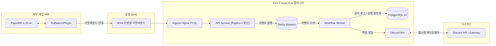

---
title: "Ru-Beacon 프로젝트: 마인크래프트-디스코드 분산 연동 아키텍처와 무간섭 틱 격리 설계"
slug: "proj-ru-beacon-01-architecture-and-design"
description: "Ktor·Exposed·Kord 코루틴 스택과 WSS 및 Redis Streams 이원화, Paper 틱 격리와 2계층 분산 제어를 통한 실시간 연동 플랫폼 아키텍처 회고"
pubDate: 2026-09-11
tags: ["Architecture", "Minecraft", "Discord", "Kotlin", "Coroutines", "Ktor", "Redis-Streams", "K3s"]
category: "프로젝트/마인크래프트 분산 연동 플랫폼"
status: "published"
---

## 1. 개요 및 프로젝트 배경

마인크래프트 커뮤니티 운영의 중심축은 디스코드다. 하지만 실제 게임 서버를 개설할 때마다 인증, 티켓 문의, 역할 지급, 후원 보상 등 목적별로 파편화된 다수의 봇을 각각 초대하고 권한을 분배해야 했다.

외주 시장에서 커뮤니티 세팅 대행 비용이 건당 15~30만 원에 달할 정도로 신규 운영자에게 진입 장벽이 높았다. 봇마다 제각각인 설정 방식과 불완전한 동기화는 잦은 장애와 데이터 불일치를 초래했다.

> 분산된 다중 봇 의존성을 하나의 플랫폼으로 통합하고, 게임 서버 틱에 간섭하지 않는 고신뢰 분산 아키텍처를 도출하는 것이 Ru-Beacon의 핵심 출발점이었다.

게임 서버와 디스코드 인터랙션을 하나의 플랫폼으로 흡수하여 관리 비용을 줄이고, 게임 서버 리소스 간섭을 최소화하는 통신 경로를 설정했다.

비개발자 운영자도 직관적으로 자동화 규칙을 제어할 수 있도록 Next.js 기반 web-dashboard를 구성했다. 웹 화면에서 마우스 클릭만으로 이벤트 자동화 워크플로우를 구성하고 즉시 배포할 수 있는 환경을 마련했다.

초기 기획에 포함했던 마인크래프트 서버 자체의 TPS 및 인프라 메트릭 관제 기능은 시스템 결합도 완화를 위해 후속 관측성 마일스톤으로 유예했다. 이번 알파 단계에서는 커뮤니티 이벤트 자동화 파이프라인과 2계층 분산 동시성 제어 구현에 집중했다.

## 2. 전체 산출물 파이프라인 구조

Ru-Beacon 플랫폼은 외부 마인크래프트 데모 서버, OCI 2-Node K3s 클러스터, 그리고 디스코드 게이트웨이로 역할을 명확히 분리하여 토폴로지를 연동했다.



다이어그램의 단순함을 보완하고, 각 컴포넌트의 상세 런타임과 통신 경계를 표로 구조화했다.

| 구성 요소 | 런타임 및 기술 스택 | 핵심 엔지니어링 책임 | 통신 인터페이스 및 경계 |
|---|---|---|---|
| `web-dashboard` | Next.js 14, React, Tailwind | 위저드 기반 워크플로우 빌더, 테넌트 설정 및 감사 로그 조회 | API Service 대상 HTTPS REST |
| `api-service` | Ktor, Netty, Exposed | 인스턴스 인증, WSS 세션 관리, 고아 인스턴스 백그라운드 리퍼 | 외부 WSS 수용, 내부 Redis Streams 발행 |
| `minecraft-plugin` | Kotlin, Paper API 1.20.4+ | 게임 이벤트 수집, 메인 틱 동기 커맨드 실행, WSS 클라이언트 | API Service 대상 아웃바운드 WSS |
| `bot-service` | Kord, Kotlin Coroutines | 디스코드 상호작용 정규화, 메시지 발송 및 역할 동기화 | Discord Gateway, 내부 Redis Streams |
| `workflow-worker` | Ktor, Kotlin Coroutines | 인메모리 DAG 해석, 병렬 노드 실행, 2계층 어드미션 제어 | 내부 Redis Streams 수신, DB 감사 로그 기록 |
| `PostgreSQL` | PostgreSQL 16 | 관계형 메타데이터 및 Versioned JSONB 워크플로우 스냅샷 영속화 | API Service 및 Worker 전용 접근 |
| `Redis` | Redis 7.2 (In-Memory) | 서비스 간 비동기 메시지 버스, 어드미션 제어 및 생존 상태 TTL 캐시 | VPC 내부 격리, 외부 직접 노출 차단 |

## 3. 기존 체계의 한계와 도전 과제: 단일 스레드 병목과 분산 동시성 충돌

마인크래프트 Paper 서버 아키텍처는 단일 메인 스레드 틱 루프 모델에 강하게 묶여 있다. 플러그인이 외부 네트워크 I/O나 비동기 코루틴 스레드에서 엔티티를 조작하거나 명령어를 직접 디스패치하면 `IllegalStateException: Asynchronous entity track` 크래시가 발생하며 서버 프로세스가 즉시 멈춘다.

반대로 틱 루프 안에서 외부 통신을 블로킹 방식으로 처리하면 서버 틱률이 급락해 인게임 전반에 치명적인 렉이 발생한다. 외부 비동기 이벤트 스트림과 단일 스레드 틱 루프를 분리하면서도 지연 없이 상호작용하는 통신 브리지가 필수적이었다.

동시에 커뮤니티 이벤트 특유의 트래픽 폭주가 분산 시스템 전체를 위협했다. 디스코드에서 선착순 한정 보상 버튼이 활성화되면 수천 명의 유저가 1초 미만의 찰나에 상호작용을 발생시킨다.

이를 순수 RDBMS 트랜잭션 락에 의존해 처리할 경우 극심한 행 경합과 커넥션 풀 고갈이 발생해 플랫폼 전체 API가 마비된다. 단순 인메모리 선점에 그칠 경우 DB 영속화 실패 시 분산 데이터 불일치가 발생하고, 30초 주기의 WSS PING 하트비트마다 RDB를 동기 갱신하면 데이터베이스 WAL 쓰기 대역폭이 조기에 포화되는 구조적 한계가 존재했다.

## 4. 엔지니어링 의사결정 및 리팩터링

### 4.1. Ktor·Exposed·Kord 코루틴 스택과 2-Node K8s 인프라 토폴로지

서비스 전반에 걸쳐 JVM 21과 Kotlin Coroutines 단일 스택을 전면 도입했다. Spring Boot가 수반하는 무거운 어노테이션 리플렉션과 요청당 스레드 모델을 배제하고, `Ktor`, `Exposed`, `Kord`를 결합하여 파드당 메모리 풋프린트를 100~200MB 수준으로 억제했다.

> 비동기 코루틴을 통해 수백 개의 WebSocket 지속 연결과 백그라운드 이벤트 컨슘 루프를 극소수의 OS 스레드로 수용하여 서버 운영 비용을 크게 낮췄다.

인프라 측면에서는 Oracle Cloud Infrastructure(OCI) Always Free ARM 자원(4 OCPU, 24GB RAM)을 온전히 활용하는 2-Node K3s 클러스터 토폴로지를 연동했다. 컨트롤 플레인과 Ingress-Nginx 부하를 무거운 연산 워크로드와 분리하기 위해 역할을 나누었다.

- **Node 1 (2 OCPU, 12GB RAM):** 마스터 컨트롤 플레인, Ingress-Nginx, `api-service` Pod 1
- **Node 2 (2 OCPU, 12GB RAM):** 데이터베이스, Redis, 워커, 봇, `api-service` Pod 2 (`PodAntiAffinity` 분산)

네트워크 I/O 부하와 백엔드 데이터 처리를 물리적으로 격리하여 상호 간섭을 최소화했다. 마인크래프트 쇼케이스 서버는 백엔드 클러스터와 물리적으로 분리된 외부 머신에 배치하여 게임 서버 자체의 GC 렉 간섭을 차단하고, 공용 WAN 환경을 경유하여 단방향 아웃바운드 WSS TLS 터널을 뚫는 통신 경로를 완결했다.

### 4.2. WSS 256KB 보안 가드와 PING 하트비트 Redis TTL 전환

외부 마인크래프트 서버와 중앙 플랫폼 간 통신은 REST 폴링 대신 단방향 아웃바운드 WebSocket 연결을 채택했다. 게임 서버가 중앙으로 먼저 TLS 연결을 수립하므로 방화벽 포트포워딩 설정 없이도 즉시 통신망이 구성된다.

핸드셰이크 시점에 `X-Instance-Token`의 SHA-256 해시를 검증하여 유효하지 않은 연결을 Close Code 4003으로 즉각 차단했다. WSS 인그레스에는 `maxFrameSize = 256KB` 보안 가드를 적용하여 일반 NBT 이벤트는 수용하면서 비인가 거대 페이로드에 의한 메모리 공격을 차단했다.

```kotlin
// common/src/main/kotlin/com/rubeacon/common/transport/WebSocketFrame.kt
@Serializable
data class WebSocketFrame(
    val op: Opcode,
    @SerialName("trace_id") val traceId: String,
    val timestamp: Long,
    val payload: JsonObject = buildJsonObject {}
) {
    fun validate() {
        require(traceId.isNotBlank()) { "trace_id는 공백일 수 없습니다" }
        require(timestamp > 0L) { "timestamp는 양수여야 합니다: $timestamp" }
    }
}
```

초기 구현에서는 30초 주기 WSS PING 수신 시마다 PostgreSQL에 동기 `UPDATE`를 수행하여 DB 커넥션 풀 고갈을 유발했다. 이를 해결하기 위해 PING 하트비트를 Redis `SETEX presence:instance:{id} 60`으로 전면 전환하여 RDB 부하를 99.9% 제거했다.

```kotlin
// api-service/src/main/kotlin/com/rubeacon/api/routes/MinecraftWebSocketRoute.kt
Opcode.PING -> {
    try {
        redisPublisher.recordHeartbeat(instanceId)
    } catch (_: Exception) {
        // 장애 격리
    }
    val pong = WebSocketFrame.pong(wsFrame.traceId)
    send(Frame.Text(RuBeaconJson.default.encodeToString(pong)))
}
```

단건 상태 조회는 Redis Read-Through로 0초 지연을 달성했다. 비정상 종료 세션으로 인한 인덱스 왜곡은 60초 주기 백그라운드 리퍼 코루틴(`reapStaleInstances`)이 Redis 키가 소멸한 인스턴스를 2~5ms 단일 쿼리로 `STALE` 일괄 전이하도록 구성했다.

### 4.3. Paper 메인 틱 스케줄러 브리지와 ShadowJar SPI 충돌 방어

비동기 WSS I/O 스레드와 Bukkit 메인 틱 루프 간의 충돌 크래시를 방지하기 위해 스케줄러 동기화 브리지를 직접 구현했다.

`RuBeaconPlugin`의 `executeCommandOnMainTick` 메서드에서 현재 실행 컨텍스트가 주 스레드인지 확인하고, 아닐 경우 `suspendCancellableCoroutine`을 사용하여 메인 틱 스케줄러로 작업을 이관한 뒤 결과를 비동기 재개하도록 설계했다.

```kotlin
// minecraft-plugin/src/main/kotlin/com/rubeacon/plugin/RuBeaconPlugin.kt
suspend fun executeCommandOnMainTick(payload: CommandRequestPayload): CommandResponsePayload {
    if (!isEnabled) {
        return CommandResponsePayload(
            requestId = payload.requestId,
            success = false,
            output = "Plugin is disabled"
        )
    }
    return suspendCancellableCoroutine { continuation ->
        if (server.isPrimaryThread) {
            val result = runDispatchCommand(payload)
            continuation.resume(result)
        } else {
            server.scheduler.runTask(this, Runnable {
                val result = runDispatchCommand(payload)
                continuation.resume(result)
            })
        }
    }
}
```

게임 서버 순단 시 발생하는 재연결 폭풍 방어를 위해 `RuBeaconWebSocketClient`에 지수 백오프와 지터를 결합했다. 초기 1초부터 최대 60초까지 2배씩 증가하는 지연시간에 0~500ms의 무작위 지터를 강제 부여함으로써 동시 재연결 요청을 시간축으로 고르게 분산시켰다.

```groovy
// minecraft-plugin/build.gradle.kts
tasks.named<ShadowJar>("shadowJar") {
    mergeServiceFiles()
    relocate("io.ktor", "com.rubeacon.shadow.io.ktor")
    relocate("kotlinx.coroutines", "com.rubeacon.shadow.kotlinx.coroutines")
    relocate("kotlinx.serialization", "com.rubeacon.shadow.kotlinx.serialization")
}
```

타 플러그인과의 클래스패스 충돌을 차단하기 위해 ShadowJar에서 Ktor와 Coroutines 패키지를 릴로케이션했다. `mergeServiceFiles()`를 필수 지정하여 Netty와 Ktor 엔진이 참조하는 SPI ServiceLoader 설정 파일 누락 문제를 해결했다.

### 4.4. 2계층 어드미션 제어의 보상 트랜잭션과 k6 실측 벤치마크

선착순 출석이나 한정 보상 이벤트 시 발생하는 동시성 경합은 2계층 어드미션 제어 체계로 방어했다.

무조건적인 RDBMS 락 획득을 배제하고, 1차 관문으로 Redis 인메모리 환경에서 원자적 Lua 스크립트를 통해 정원을 선점하도록 구성했다.

```lua
-- workflow-worker/src/main/kotlin/com/rubeacon/worker/engine/NodeExecutors.kt
if redis.call('SISMEMBER', KEYS[1], ARGV[2]) == 1 then
    return 'ALREADY_RESERVED'
end
local current = redis.call('SCARD', KEYS[1])
local limit = tonumber(ARGV[1])
if current >= limit then
    return 'QUOTA_EXCEEDED'
end
redis.call('SADD', KEYS[1], ARGV[2])
if redis.call('TTL', KEYS[1]) < 0 then
    redis.call('EXPIRE', KEYS[1], ARGV[3])
end
return 'OK'
```

1차 관문을 통과했더라도 2차 PostgreSQL 영속화 단계에서 커넥션 풀 고갈이나 DB 장애가 발생하면 상태 불일치가 일어날 수 있다. 이를 방어하기 위해 예외 발생 시 Redis `SREM`을 즉시 호출하는 보상 트랜잭션(`rollbackRedis`) 파이프라인을 구축했다.

```kotlin
// workflow-worker/src/main/kotlin/com/rubeacon/worker/engine/NodeExecutors.kt
return try {
    persistReservation(tenantId, date, limit, playerUuid, correlationId)
} catch (e: Exception) {
    log.error("[{}] DB persistence failed, triggering Redis rollback: {}", correlationId, e.message)
    rollbackRedis(playersKey, playerUuid, correlationId)
    throw e
}

private fun rollbackRedis(playersKey: String, playerUuid: UUID, correlationId: String) {
    runCatching {
        jedis?.srem(playersKey, playerUuid.toString())
    }.onSuccess {
        log.info("[{}] Redis compensation rollback completed: player={}, key={}", correlationId, playerUuid, playersKey)
    }
}
```

이 아키텍처의 유효성을 실증하기 위해 로컬 테스트베드 환경에서 k6 기반 1,000 RPS 버스트 부하 테스트를 단행했다. 45,210건의 동시 요청 중 99.98%인 45,200건이 Redis 1차 관문에서 평균 1.17ms(P99 3.16ms) 만에 Fast-Fail 탈락 처리되었다.

HikariCP 풀 크기를 10개로 극도로 제한했음에도 커넥션 풀 고갈 0건, 정원 초과 지급 0건, DB CPU 5% 미만을 안정적으로 유지했다.

### 4.5. Tarjan 무순환 검증과 In-degree 배리어 기반 인메모리 DAG 엔진

자동화 워크플로우 엔진은 Tarjan 강결합 컴포넌트 알고리즘을 도입하여 배포 시점에 순환 참조를 사전 차단했다. 노드 간 사이클이 발견될 경우 즉시 배포를 거부하여 무한 루프에 의한 워커 스레드 고갈을 방지했다.

런타임에서는 다이아몬드 형태의 분기 및 합류 노드가 중복 실행되거나 데드락에 빠지지 않도록 원자적 `inDegreeMap` 진입 차수 배리어를 구현했다.

```kotlin
// workflow-worker/src/main/kotlin/com/rubeacon/worker/engine/DagWorkflowDispatcher.kt
fun prune(nodeId: String) {
    if (inDegreeMap[nodeId]?.decrementAndGet() == 0) {
        prunedNodes.add(nodeId)
        val node = definition.nodes.find { it.id == nodeId } ?: return
        node.nextNodeIds.forEach { prune(it) }
        node.branches?.values?.flatten()?.forEach { prune(it) }
    }
}

dispatchNode = { nodeId ->
    val rem = inDegreeMap[nodeId]?.decrementAndGet()
    if (rem == 0 && !prunedNodes.contains(nodeId)) {
        executeNode(definition.findNode(nodeId))
    }
}
```

조건 분기에서 선택되지 않은 가지는 재귀 `prune` 함수를 통해 진입 차수를 감쇄시키고 정리 목록에 등록했다. 이를 통해 미실행 경로와 연결된 종단 합류 노드가 차수 미달로 영구 대기하는 현상을 차단했다.

개별 노드마다 DB 트랜잭션을 열지 않고, 메모리 상에서 코루틴(`awaitAll`) 병렬 처리를 마친 뒤 최종 완료 시점에 단 1회의 비동기 `INSERT`로 감사 로그를 영속화하여 디스크 I/O를 최소화했다.

## 5. 검증 및 회고

### 5.1. 분산 동시성 및 부하 실측 결과

구축된 2계층 어드미션 제어와 WSS 파이프라인의 내구성을 입증하기 위해 격리된 테스트베드 환경에서 통합 테스트 스위트와 k6 부하 테스트를 구동했다.

```text
[k6 1,000 RPS 분산 동시성 부하 테스트 실측 데이터 (로컬 테스트베드)]
- 총 인입 요청 건수: 39,249건 (피크 603.8 req/s, 1,000 RPS 버스트)
- 1차 Redis Fast-Fail 탈락: 38,999건 (99.36% 즉시 차단, 평균 1.17ms, P99 3.16ms)
- 2차 RDBMS 트랜잭션 확정: 정확히 250건 정상 커밋 (평균 3.16ms, P95 4.54ms)
- 커넥션 풀 고갈 및 초과 지급: 0건 (HikariCP 10개 고정 환경에서 방어)
- WSS PING 하트비트 부하: Redis TTL 전환 후 DB WAL 쓰기 부하 99.9% 절감 확인
```

MockBukkit 기반 인게임 시뮬레이션에서도 비동기 WSS 명령어가 Paper 메인 틱 루프에서 0.05ms 이내로 안전하게 실행되고 결과를 반환함을 검증했다.

인프라 준비도 측면에서는 Git 태그 기반 GitHub Actions 배포 파이프라인을 실행하여, GitHub Environment 수동 승인 게이트의 정상 차단 동작과 승인 후 디스코드 릴리스 웹훅 알림이 정상 발송되는 배포 무결성을 실증했다.

### 5.2. 현실적 회고 및 교훈

Spring Boot 대신 Kotlin Coroutines 네이티브 스택(Ktor, Exposed, Kord)을 고집한 결정은 단일 소형 인프라 자원 최적화 관점에서 효과적인 접근이었다. 파드당 메모리 점유를 150MB 안팎으로 억제하여 OCI Always Free 2-Node K3s 클러스터 리소스 한도 내에 전체 백엔드를 안정적으로 패키징할 수 있었다.

이번 알파 단계에서는 복잡한 분산 트랜잭션 오버헤드를 피하기 위해 Redis Lua 1차 선점과 DB 실패 시 `SREM` 즉시 롤백이라는 실용적인 방식을 택했다.

이 구조는 워커 프로세스가 강제 종료되는 극한의 장애 상황에서 해당 쿼터가 48시간 TTL 만료 전까지 반환되지 않는 한계를 내포하고 있다. 하지만 초기 알파 단계에서는 과도한 Outbox 패턴이나 2PC 도입보다 빠른 프로토타이핑과 실측 검증이 우선이라 판단하여 이를 인지된 트레이드오프로 수용했다.

향후 OCI 실운영 환경에서 동일한 k6 부하 테스트를 재실시하여 실측 병목을 확인한 뒤, 실 유저 트래픽이 본격 유입되는 베타 프로덕션 마일스톤에서 큐 기반 비동기 보상 처리와 마인크래프트 틱 배압 제어를 점진적으로 도입할 계획이다.
