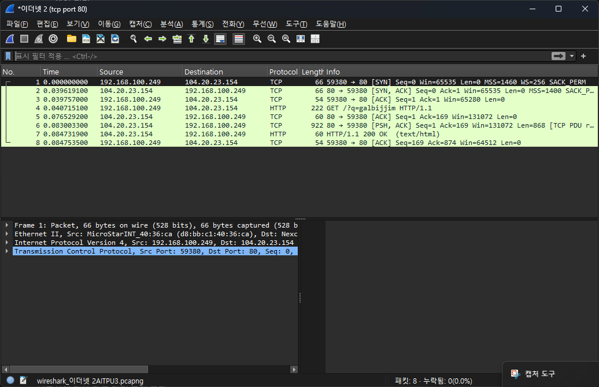
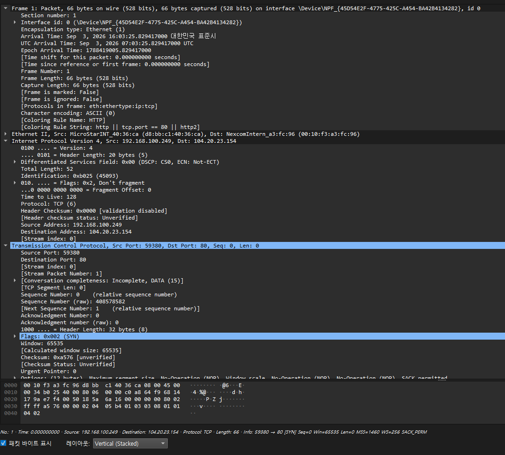
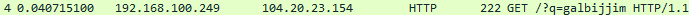

*6교시. 종합 실습 — 패킷 분석 보고서*

# Day 1 패킷 분석 보고서 (한승윤 / 26.09.03)

## 1. 캡처 환경
- 내 IPv4 주소: 192.168.100.249
- 내 MAC 주소: D8-BB-C1-40-36-CA
- 기본 게이트웨이: 192.168.1.1
- 게이트웨이의 MAC 주소: 00-10-f3-a3-fc-96
- 내가 쓰는 DNS 서버: 168.126.63.1
- 접속한 사이트와 서버 IP: example.com / 104.20.23.154

## 2. 연결이 열리는 순간 — 3-way Handshake

| 순서 | Source | Destination | Info |
|---|---|---|---|
| 0 | 192.168.100.249 | 104.20.23.154 | [SYN] |
| 1 | 104.20.23.154 | 192.168.100.249 | [SYN, ACK] |
| 2 | 192.168.100.249 | 104.20.23.154 | [ACK] |

세 줄이 의미하는 것: OK 싸인 요청 -> OK -> 그럼 나도 OK

## 3. 헤더 분석

| 항목 | 값 | 어느 헤더 |
|---|---|---|
| 출발지 IP | 192.168.100.249 | IP 헤더 (3층) |
| 목적지 IP | 104.20.23.154 | IP 헤더 (3층) |
| TTL | 128 | IP 헤더 (3층) |
| 출발지 포트 | 51234 | TCP 헤더 (4층) |
| 목적지 포트 | 443 | TCP 헤더 (4층) |
| 플래그 | SYN | TCP 헤더 (4층) |

## 4. 연결이 닫히는 순간, 그리고 내가 열어 둔 문
- tcp.flags.fin == 1 필터에 잡힌 줄 수: 0
- RST 줄이 있었나: 없다. 인사를 주고받고 정상적으로 닫힌 연결이다
- 작별이 악수보다 한 번 더 필요한 이유: 열 때는 서버의 확인(ACK)과 요청(SYN)을 한 패킷에 합칠 수 있지만, 닫을 때는 아직 보낼 데이터가 남아 있을 수 있어 합칠 수 없기 때문이다
- netstat -n에서 고른 연결 한 줄: 192.168.100.249:60315  104.17.24.14:443       TIME_WAIT
- 그 상태가 무슨 뜻인지: 방금 끝난 연결이 혹시 모를 재전송에 대비해 잠시 자리를 지키는 상태다. 고장이 아니다.
- 그 연결을 만든 프로그램: PID 17728 / chrome.exe
- LISTENING으로 열어 둔 문: 9개 / 그중 445가 열려 있었다

## 5. 평문과 암호문

- http 스트림에서 읽을 수 있었던 것: 요청한 주소(GET / HTTP/1.1), 접속한 사이트 이름, 내 브라우저와 운영체제 종류
- tls 스트림에서는 어땠나: 읽을 수 있는 문장이 하나도 없고 알아볼 수 없는 기호만 이어졌다
- 여기서 느낀 것: 같은 Wi-Fi에 있는 사람이 내 http 통신을 그대로 볼 수 있다는 뜻이다. 로그인은 https에서만 해야 한다.

## 6. 오늘 배운 것 세 줄
- 네트워크는 7개 층으로 나뉘어 있고, 진단은 아래층부터 한다
- TCP는 악수 세 번으로 연결을 열고, 작별 네 번으로 닫는다
- ping·nslookup·브라우저 순서로 확인하면 장애 위치를 층 단위로 좁힐 수 있다